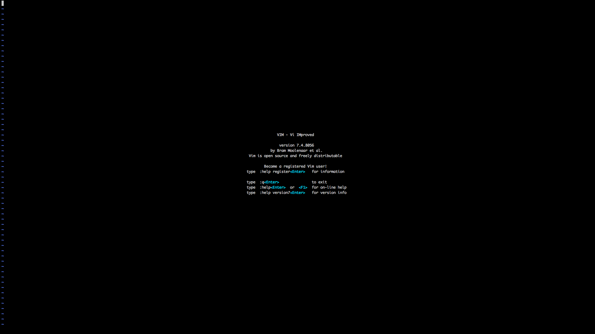
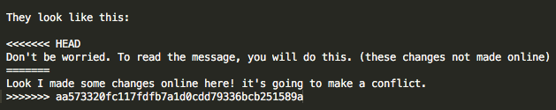

# Git / GitHub Troubleshooting

GitHub and Git are great, but sometimes things go wrong. Here are solutions to some common problems with git.


## Command Line Specific

* Help what is this screen? / Help my computer won't let me type!

Git assumes that you give a message describing every change you have made, so much so that, if you don't give a message, it will ask you to write one. So if you haven't given a commit message (sometimes can happen when pulling changes as well), you might get a screen like this:



What's happened here is your terminal has turned into a text editor, politely asking for you to enter a message. [Vim](http://www.vim.org/) is the editor in question here, and it's loaded in your terminal. Because your terminal doesn't have any icons, buttons, or images to click on, it relies only on text input. This makes text editing complicated - after all, you will still *want* to do all the things that those buttons let you do in Microsoft Word. You'll still want to save, undo, copy, paste, etc. This means that each key has multiple functions. It gets confusing quickly, and the learning curve is high. Vim is worth learning, but, for now the easiest thing to do is just run away. To do that, type in the following:

```
:q!
```
That tells Vim to exit the current screen without saving anything.

* It won't let me push / it says some refs were rejected

You have to make sure that your copy of the repository is up to date before you can contribute changes. Otherwise you might overwrite work that someone else had done. Pull before you push - update before you send out new contributions:

```
$ git pull
$ git push
```

* Merge conflicts were detected!

DON'T PANIC. Git relies on changes on a line-by-line basis. If you change a line and commit those changes before pulling, there is a chance that you might have changed the same line as someone else in a different way. Git wants to make sure that it knows what changes it should keep as part of the permanent record, so it flags any spots where things have been changed in different ways. You can tell that you have merge conflicts by getting an error message like this:

```
CONFLICT (content): Merge conflict in github-troubleshooting.md
Automatic merge failed; fix conflicts and then commit the result.
```

They look like this:

