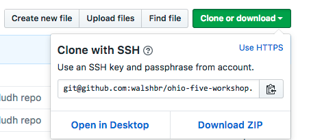
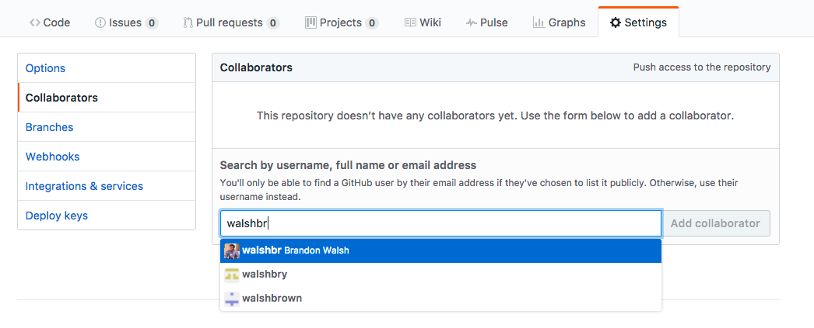
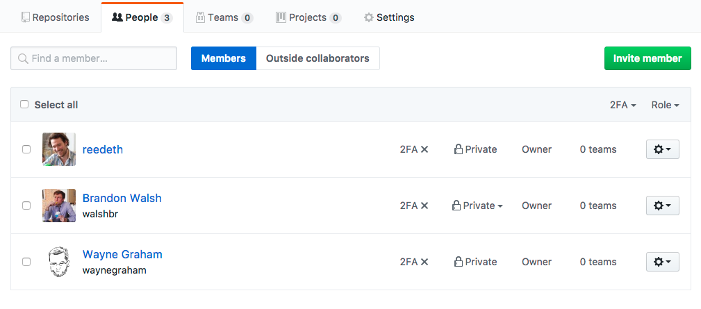
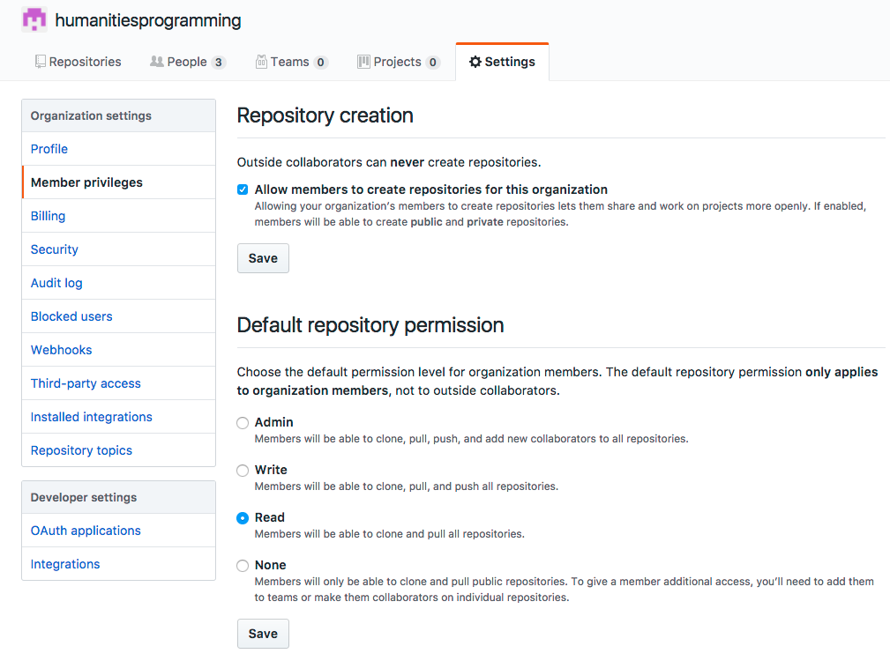

# Git / GitHub Troubleshooting

GitHub and Git are great, but sometimes things go wrong. Here are solutions to some common problems with git.

# Web Browser Specific

* It won't let me edit files

* It won't let me upload files

* My page is not rendering at github-organization.github.io


## Command Line Specific

* Help what is this screen? / Help my computer won't let me type!

Git assumes that you give a message describing every change you have made, so much so that, if you don't give a message, it will ask you to write one. So if you haven't given a commit message (sometimes can happen when pulling changes as well), you might get a screen like this:


What's happened here is your terminal has turned into a text editor, politely asking for you to enter a message. [Vim](http://www.vim.org/) is the editor in question here, and it's loaded in your terminal. Because your terminal doesn't have any icons, buttons, or images to click on, it relies only on text input. This makes text editing complicated - after all, you will still *want* to do all the things that those buttons let you do in Microsoft Word. You'll still want to save, undo, copy, paste, etc. This means that each key has multiple functions. It gets confusing quickly, and the learning curve is high. Vim is worth learning, but, for now the easiest thing to do is just run away. To do that, type in the following:

```
:q!
```
That tells Vim to exit the current screen without saving anything.

* It won't let me push / it says some refs were rejected

You have to make sure that your copy of the repository is up to date before you can contribute changes. Otherwise you might overwrite work that someone else had done. Pull before you push - update before you send out new contributions:

```
$ git pull
$ git push
```

* Merge conflicts were detected!

DON'T PANIC. Git relies on changes on a line-by-line basis. If you change a line and commit those changes before pulling, there is a chance that you might have changed the same line as someone else in a different way. Git wants to make sure that it knows what changes it should keep as part of the permanent record, so it flags any spots where things have been changed in different ways. You can tell that you have merge conflicts by getting an error message like this:

```
CONFLICT (content): Merge conflict in github-troubleshooting.md
Automatic merge failed; fix conflicts and then commit the result.
```

To get a list of merge conflicted styles, run git status:

```
$ git status
```

Merge conflicts in a particular file look like this:


A merge conflict is flagged on either side by <<<<<<< followed by HEAD and >>>>>>>> followed by a long hash key that identifies a change you've made. They're divided in the middle by a series of equals signs - ======. So you can easily find them in the project as a whole by doing a "search all files" for "<<<<<." In sublime text, that is command + shift + f. This will give you a list of to do's.

From there, the first half of the commit shows you the changes made to those lines in the remote repository - so these are the changes that you did not have on your computer when you committed. The second half below the equals signs signfiy the changes that were on your computer. So to correct the merge conflict, you'll want to edit the text to resolve the two distinct versions into one. And then drop all of the <<<<<< HEAD and >>>>>> aa5733… bits (those are just to help you make sense of the conflict, and you don't want those in the final version). So here, an unconflicted version might look like:

```
Don't be worried. I made some changes online, but no conflict.
```
Then go through the normal git workflow to add, commit, and push your files.

```
$ git add .
$ git commit -m 'a message describing what you did'
$ git push
```

* My pushes to GitHub fail, but I've pulled and things are up to date.
First, check to make sure that you have the correct remote listed so that GitHub knows where to be pushing:

```
$ git remote -v
```
This should give you some flavor of:
```
origin	git@github.com:walshbr/ohio-five-workshop.git (fetch)
origin	git@github.com:walshbr/ohio-five-workshop.git (push)
```
Where the second bit - git@github.com… - should match the clone/download URL taken from the right side of the main page of your repository. Clicking on the big green button should make something like this come up:



If it doesn't match, you'll need to add a pointer to the repository so your computer knows where to send code:

```
$ git remote add origin YOUR-CLONE-URL-HERE
```

Then you should be able to push as normal. If you already have the remote added and things are still not working.

If not, check to make sure you're a contributor to the repository/organization. You'll need the owner of the repository to add you:



Or, if you're working with a GitHub organization you can add a member to the organization from the people page of the organization:



Then, you can assign default permissions to "write" for everyone in the organization from the settings page of the organization:



If you have a proper git remote and write permissions to the repository, you might need to attach an ssh key to your github credentials. GitHub has good tutorials for this that should be followed in this order: 

1. [Checking for existing SSH keys](https://help.github.com/articles/generating-a-new-ssh-key-and-adding-it-to-the-ssh-agent/)
2. [Generating a new SSH key and adding it to the SSH agent](https://help.github.com/articles/generating-a-new-ssh-key-and-adding-it-to-the-ssh-agent/)
3. [Adding a new SSH key to your GitHub Account](https://help.github.com/articles/adding-a-new-ssh-key-to-your-github-account/)